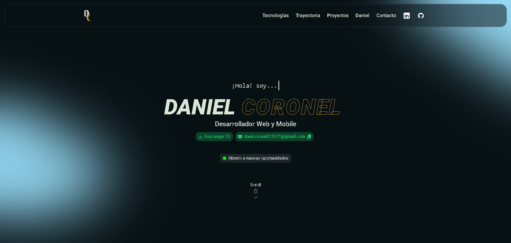

# 💼 Portfolio Angular

A modern personal portfolio website built with Angular to showcase my skills, projects, and experience in web development.  

---

## 📄 About Me
I'm **Daniel Coronel**, a web developer from Paraguay 🇵🇾 passionate about building modern, responsive, and interactive web applications.  
I specialize in **JavaScript, TypeScript, Angular, HTML, CSS, and Blazor**, and I enjoy turning ideas into functional and aesthetic digital products.  

---

## 📌 Description
This is my personal portfolio, designed and developed with **Angular** to highlight my projects and professional profile.  
The main goals of this project were to:  
- Practice and deepen my knowledge of **Angular** and **TypeScript**  
- Apply concepts of **component-based architecture** and **responsive design**  
- Build a professional space to showcase my work and technical skills  

It’s intended for recruiters, collaborators, and anyone interested in my professional journey.  

---

## 🛠 Technologies used
- **Angular 17** (framework)  
- **TypeScript** (logic and structure)  
- **JavaScript (ES6+)** (interactivity)  
- **HTML5** (markup)  
- **CSS3** (styling and responsive design)  
- **Visual Studio Code** (development environment)  
- **Netlify** (deployment and hosting)  

---

## ✨ Features
- Responsive and modern design  
- Custom-built components from scratch  
- Clean and organized project structure  
- Optimized performance for deployment on Netlify  

---

## 🌐 Live Demo
You can view the live version of this portfolio here:
👉 [danielcoronel.netlify.app/](https://danielcoronel.netlify.app/)

---

## 📸 Preview


---

## 🚀 How to run this project
```bash
# Clone the repository
git clone https://github.com/DanielCoronelPV/portfolio-angular.git

# Navigate into the project folder
cd portfolio-angular

# Install dependencies
npm install

# Run the development server
ng serve -o

# The app will be available at
http://localhost:4200/
```

---

## 📁 Structure
```bash
/portfolio
│
├── src
│   ├── app
│   │   ├── Modules
│   │   │   └── index
│   │   │       ├── components
│   │   │       │   ├── about
│   │   │       │   ├── carousel
│   │   │       │   ├── contact
│   │   │       │   ├── exp-progress
│   │   │       │   ├── experience
│   │   │       │   ├── footer
│   │   │       │   ├── formation
│   │   │       │   ├── gitprev
│   │   │       │   ├── index
│   │   │       │   ├── navbar
│   │   │       │   ├── polygon-skills
│   │   │       │   ├── profile
│   │   │       │   └── projects
│   │   │       └── index.module.ts
│   │   ├── services
│   │   │   ├── gitprev.service.ts
│   │   │   └── theme.service.ts
│   │   ├── app-routing.module.ts
│   │   ├── app.component.html
│   │   ├── app.component.scss
│   │   ├── app.component.ts
│   │   └── app.module.ts
│   ├── assets
│   ├── index.html
│   └── main.ts
│
├── angular.json
├── package.json
├── tsconfig.app.json
├── tsconfig.json
└── README.md
```
